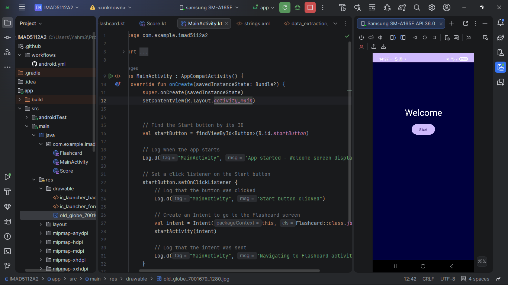
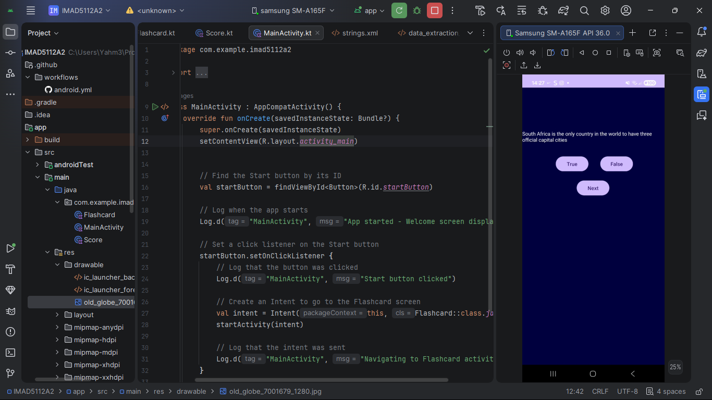
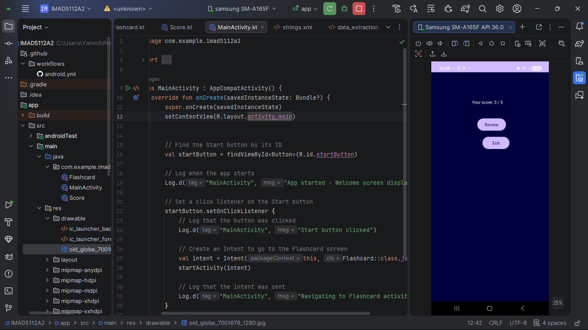
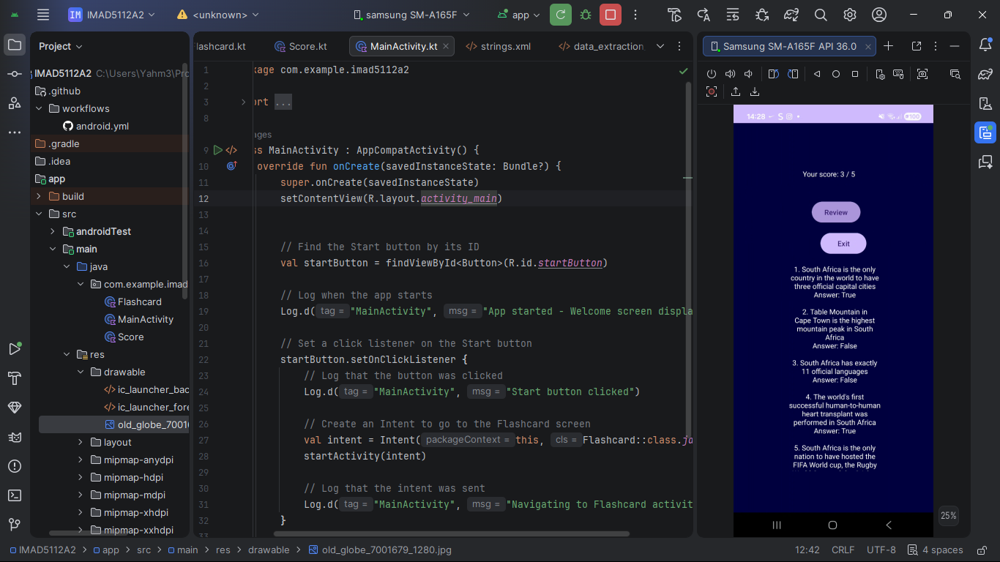

# IMA5112A2
## A school assignment project (Life Hack or Urban Myth?)
A native Android flashcard quiz app built with **Kotlin** in Android Studio.  
Test your ability to tell the difference between genuine life hacks and viral urban myths!

# Author
## > Thabelo Thanyani
## Student Number: ST10515831

# Status
[](https://github.com/Obito387/IMA5112A2/actions/workflows/android.yml)

## App Overview
The internet is full of tips, tricks, and shortcuts — but not all of them are real. This app presents statements about everyday life hacks and challenges users to decide: **Hack (True)** or **Myth (False)?**

At the end of the quiz, the app displays a personalised score with feedback, and allows the user to review all correct answers along with their explanations.

---

## Features
- **Welcome Screen** — A brief introduction to the app with a Start button to kick off the quiz
- **Flashcard Question Screen** — Presents 5 hack/myth statements one at a time, featuring:
  - **Hack** (True) and **Myth** (False) answer buttons
  - Instant feedback after each response
  - A **Next** button to move to the following question
- **Score Screen** — Displays the total number of correct answers along with personalised performance feedback
- **Review Screen** — Shows all 10 statements alongside their correct answers and explanations
---

## App Flow
```
Welcome Screen
      ↓ (Start button)
Question Screen (loops through 10 questions)
      ↓ (after last question)
Score Screen
      ↓ (Review button)
Review Screen (all answers)
```

## Design Decisions
- **View Binding** was used in place of `findViewById` for type-safe, null-safe UI access
- **FlashcardRepository** is implemented as an `object` (singleton) to centralise all question data, making it straightforward to add or update questions from a single location
- **Log statements** are included across all activities with unique tags (`TAG`) to assist with debugging and demonstrate an understanding of Android logging practices
- **RecyclerView** was selected for the Review Screen due to its efficiency in rendering scrollable lists of variable length

## Screenshots

### Welcome


### Doing the Quiz


### Awaiting Review


### Review


## How to Run
1. Clone this repository
2. Open in Android Studio
3. Connect an emulator or physical device
4. Press **Run ▶** to build and install the app

# YouTube link
https://youtu.be/XJ1lSo_OjGg?si=xg0WI9VRAaRDVubB
